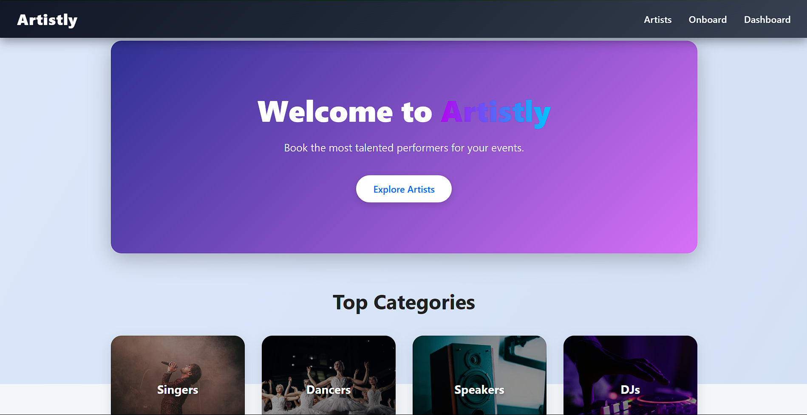
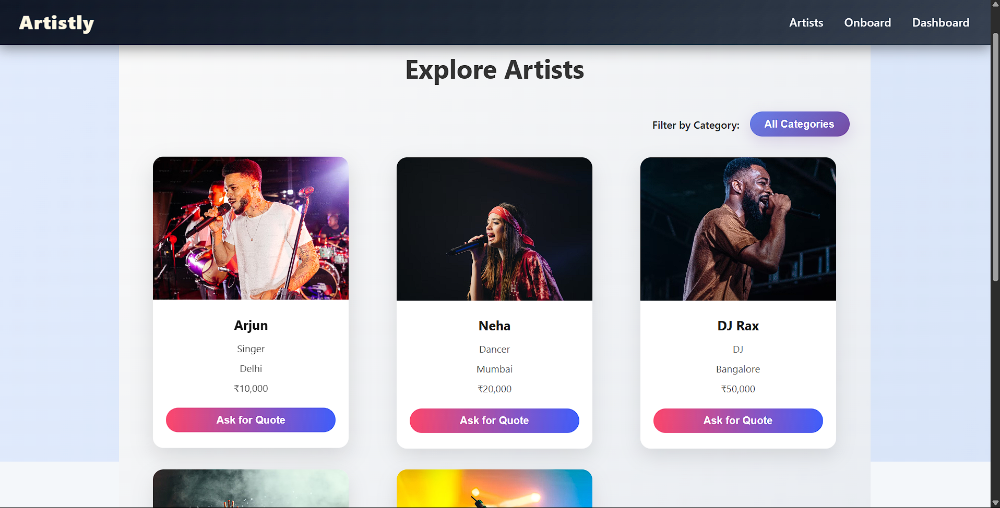
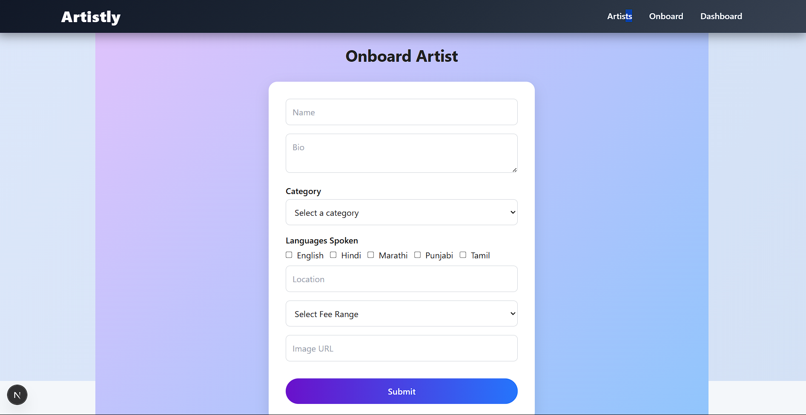
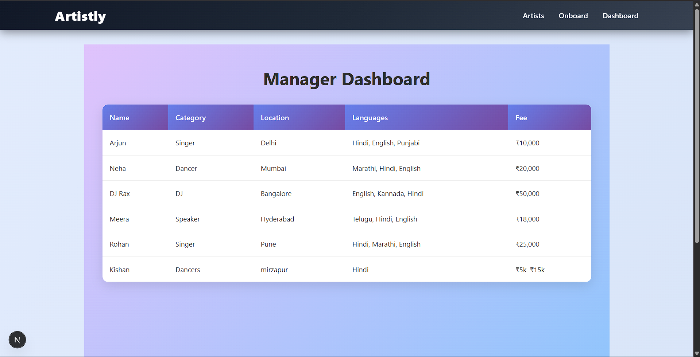

# 🎨 Artistly

**Artistly** is a fully responsive, modern web platform to discover and book **performing artists** like Singers, Dancers, DJs, and Public Speakers for any event — built with **Next.js 14**, CSS Modules, and hosted on **Vercel**.

🌐 **Live App**: [https://artistly-app-chi.vercel.app](https://artistly-app-chi.vercel.app)  
📂 **GitHub Repo**: [github.com/Kishan89/ArtistlyApp](https://github.com/Kishan89/ArtistlyApp)

---

## ✨ Features

- ✅ Explore artist cards by category and fee
- ✅ Onboard new artists via validated form
- ✅ Category dropdown & dynamic filtering
- ✅ Dashboard to view all registered artists
- ✅ Beautiful gradients, shadows, and hover effects
- ✅ Fully mobile-responsive with smooth UI
- ✅ Optimized for deployment with Vercel

---

## 📸 Preview

| Home Page                        | Artist Cards                         | Onboard Form                        | Dashboard                                  |
| -------------------------------- | ------------------------------------ | ----------------------------------- | ------------------------------------------ |
|  |  |  |  |

---

## 🚀 Tech Stack

- **Next.js 14 App Router**
- **CSS Modules** (Modular SCSS-like syntax)
- **React Hook Form** + **Yup Validation**
- **Unsplash Images** for category backgrounds
- **Vercel** for hosting and CI/CD

---

## 📁 Folder Overview

ArtistlyApp/
├── app/ # App directory (Next.js 14 routing)
│ ├── page.js # Home Page
│ ├── artists/ # Explore Page
│ ├── onboard/ # Onboard Form Page
│ └── dashboard/ # Manager Dashboard Page
├── components/ # Header, Footer, Cards, Filters
├── data/ # Static data (artists.json, categories.json)
├── styles/ # CSS Modules for scoped styling
├── public/ # Public assets (screenshots etc.)
└── README.md

---

## 🛠️ Installation & Setup

```bash
git clone https://github.com/Kishan89/ArtistlyApp.git
cd ArtistlyApp
npm install
npm run dev
```
